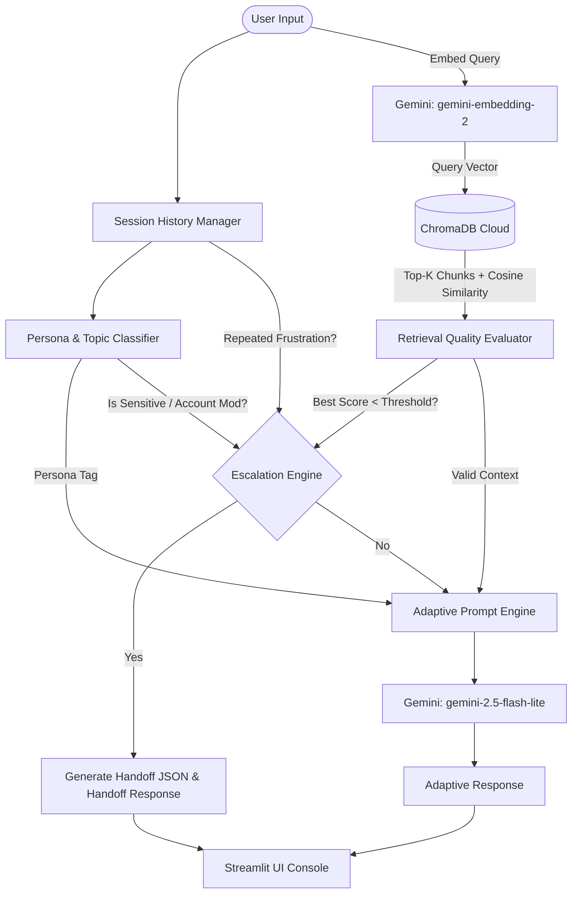

# Persona-Adaptive Customer Support Agent

An intelligent, production-ready customer support agent that adapts its response style based on customer communication personas. It uses a **Retrieval-Augmented Generation (RAG)** architecture grounded in a remote **ChromaDB Cloud** instance, and features a stateful **Escalation Engine** that generates structured JSON handoff reports for human responders.

---

## 🏗️ System Architecture



---

## 🌟 Key Engineering Features

1.  **ChromaDB Cloud Integration**: 
    Connects directly to the remote ChromaDB hosted cloud database client using active credentials. It leverages the collection **`AdSparxAI`** for vector queries.
2.  **Self-Healing Database Client**:
    Includes a self-healing local persistent fallback. If any connection block, lock contention, or internal database metadata corruption is detected on startup, it automatically wipes the directory cache and re-initializes cleanly, preventing application crashes.
3.  **Unified Gemini SDK Model Stack**:
    *   **Embeddings**: Uses `gemini-embedding-2` with `types.Content` array wrapping for optimized batch uploads.
    *   **Text Generation**: Uses `gemini-2.5-flash-lite` for quick, high-performance, persona-adaptive reasoning.
4.  **Three-Way Stateful Escalation Engine**:
    Automatically redirects the conversation to a human support representative under three safety criteria:
    *   *Low Retrieval Confidence*: Best similarity score falls below `0.40`, or no documents are retrieved.
    *   *Sensitive Topics*: Query explicitly mentions billing disputes, duplicate charges, refund requests, account deletion, or legal threats.
    *   *Repeated Frustration*: The user expresses negative/frustrated sentiment across **2 or more consecutive turns** (tracked statefully in Streamlit session memory).
5.  **Contextual Handoff Reports**:
    When escalated, the system locks user inputs and compiles an actionable **JSON Handoff Report** containing a summary of the issue, database sources, and a custom, Gemini-generated `recommended_action` for the human agent.

---

## 📂 Project Repository Structure

```
C:\Adsparkx AI Assignment/
├── .env                          # Cloud credentials and API keys
├── .gitignore                    # standard project git ignores
├── requirements.txt              # Project package requirements
├── app.py                        # Main Streamlit Web Application
├── README.md                     # This documentation file
├── data/                         # Support Ground-Truth manuals
│   ├── api_troubleshooting.md    # API Auth, Webhooks, DB configs, and Cookie guides
│   ├── billing_policy.txt        # Billing, proration, refunds, residency, and SLA policies
│   └── password_reset_guide.pdf  # Generated step-by-step password recovery & SSO guide
├── src/                          # Backend source files package
│   ├── __init__.py
│   ├── config.py                 # Central configurations & thresholds
│   ├── logger.py                 # Console & file rotational logging (app.log)
│   ├── exceptions.py             # Custom exceptions definitions
│   ├── classifier.py             # Structured Pydantic persona classifier
│   ├── rag_pipeline.py           # Ingestion, parsing, and cloud RAG pipeline
│   ├── generator.py              # Persona instructions & response generation
│   ├── escalator.py              # Escalation triggers & handoff report generator
│   └── generate_kb.py            # Programmatic database document generator
└── tests/
    └── test_system.py            # Verification scenario runner (paced to prevent rate limits)
```

---

## ⚙️ Setup & Execution Instructions

### 1. Configure the Environment
Add your API credentials inside the [**.env**](file:///C:/Adsparkx%20AI%20Assignment/.env) file at the root level of your directory:

```env
CHROMA_HOST=api.trychroma.com
CHROMA_API_KEY="your_chroma_cloud_api_key"
CHROMA_TENANT="your_tenant_id"
CHROMA_DATABASE="your_database_name"
GEMINI_API_KEY="your_google_gemini_api_key"
```

### 2. Activate the Virtual Environment
Open your terminal in the `C:\Adsparkx AI Assignment` directory and run:

*   **PowerShell**:
    ```powershell
    .\venv\Scripts\Activate.ps1
    ```
*   **Command Prompt**:
    ```cmd
    .\venv\Scripts\activate.bat
    ```

### 3. Install Dependencies
```bash
pip install -r requirements.txt
```

### 4. Ingest and Compile the Knowledge Base
To compile the three expanded domain manuals (including programmatically building `password_reset_guide.pdf` using ReportLab), run:
```bash
python -m src.generate_kb
```

### 5. Run Automated Scenario Checks
Replay the five core testing scenarios outlined in the PDF specification. The test runner is paced with 15-second intervals to safely execute within Gemini Free Tier limits:
```bash
python -m tests.test_system
```

### 6. Launch the Streamlit Web Console
To launch the interactive dashboard and test it in your browser:
```bash
streamlit run app.py
```
Open `http://localhost:8501` to use the application UI!
